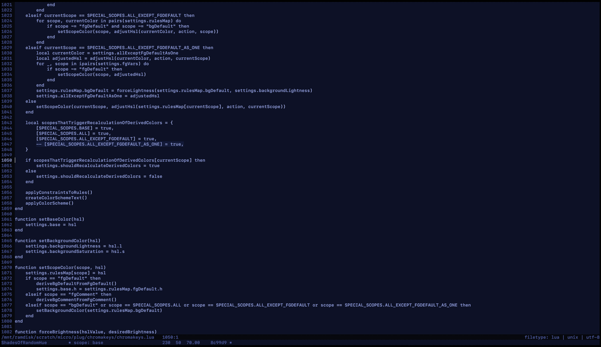
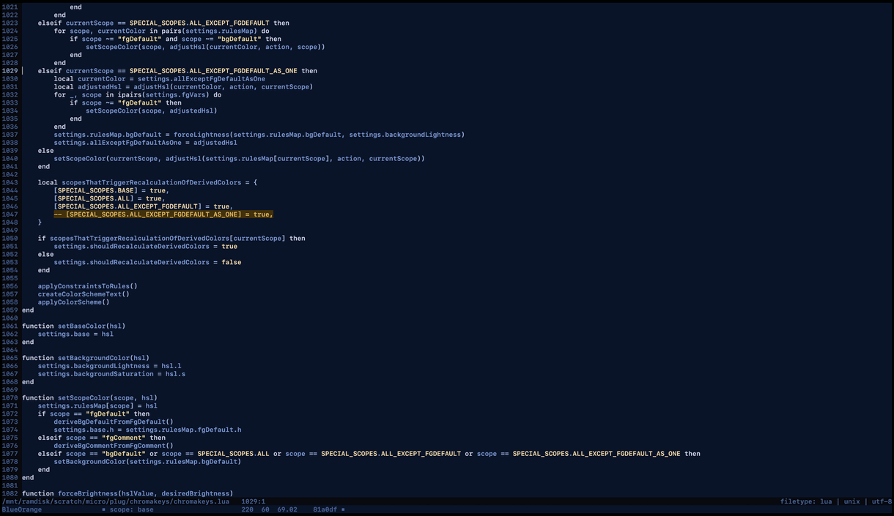

# ChromaKeys

## Create color schemes within [Micro](https://github.com/zyedidia/micro) using only the keyboard

You can adjust individual scopes:



Or you can generate entire color schemes using a variety of palettes:



## Installation

Clone this repository into `~/.config/micro/plug`.

## Usage

You'll need to bind the following commands to keyboard shortcuts of your choice.

```
"Alt-j":			"command:ckFirstColorScheme",
"Alt-L":			"command:ckForceLogRules",
"Alt-3":			"command:ckGenerateColorScheme",
"Alt-g":			"command:ckGenerateColorScheme",
"F8":				"command:ckGenerateColorScheme",
"Shift-F5":			"command:ckHueDec",
"Shift-F9":			"command:ckHueDecLarge",
"F5":				"command:ckHueInc",
"F9":				"command:ckHueIncLarge",
"Shift-F7":			"command:ckLightnessDec",
"Shift-F11":		"command:ckLightnessDecLarge",
"F7":				"command:ckLightnessInc",
"F11":				"command:ckLightnessIncLarge",
"Alt-2":			"command:ckNextColorFunction",
"Alt-l":			"command:ckNextColorScheme",
"Alt-h":			"command:ckNextGroup",
"Alt-1":			"command:ckPreviousColorFunction",
"Alt-k":			"command:ckPreviousColorScheme",
"Alt-r":			"command:ckRandomiseColor",
"Alt-6":			"command:ckRandomiseHue",
"Alt-8":			"command:ckRandomiseLightness",
"Alt-7":			"command:ckRandomiseSaturation",
"Alt-R":			"command:ckResetBaseSaturationAndLightness",
"Shift-F6":			"command:ckSaturationDec",
"Shift-F10":		"command:ckSaturationDecLarge",
"F6":				"command:ckSaturationInc",
"F10":				"command:ckSaturationIncLarge",
"F1":				"command:ckSaveCurrentTheme",
"AltRight":			"command:ckScopeNext",
"AltLeft":			"command:ckScopePrevious",
"Alt-y":			"command:ckSelectColorSchemeA",
"Alt-u":			"command:ckSelectColorSchemeB",
"Alt-Y":			"command:ckSetColorSchemeA",
"Alt-U":			"command:ckSetColorSchemeB",
"Shift-F12":		"command:ckToggleDebugMode",
```

## Manual color scheme creation (adjust individual scopes separately)

If you want to adjust each scope separately, select a scope using the `ckScopeNext` and `ckScopePrevious` commands. Then use the commands below to change the scope's color:

```
ckHueDec
ckHueDecLarge
ckHueInc
ckHueIncLarge
ckSaturationDec
ckSaturationDecLarge
ckSaturationInc
ckSaturationIncLarge
ckLightnessDec
ckLightnessDecLarge
ckLightnessInc
ckLightnessIncLarge
ckRandomiseColor
ckRandomiseHue
ckRandomiseLightness
ckRandomiseSaturation
```

There are four special scopes:

- `base`: This sets the base color. If you're creating a color scheme manually (as opposed to using the palettes), this is the first scope you need to set.
- `all`: This applies the command to all scopes. Useful if you want to adjust the hue/saturation/lightness of the entire scheme.
- `allExceptFgDefault`: This adjusts everything but the foreground scope color (and the scope colors derived from it - see below).
- `allExceptFgDefaultAsOne`: Same as allExceptFgDefault, but it changes all the affected scopes in lockstep.

## Derived scope colors

The colors for these scopes are derived from other scopes:

```
Default Background (bgDefault)
Symbol (fgSymbol)
Comment background (calcBgComment)
Status line foreground (calcFgStatusLine)
Status line background (calcBgStatusLine)
Line number (calcFgLineNumber)
Current line number (calcFgCurrentLineNumber)
Message (calcFgMessage)
```

You can also change these individually, but if you then use a palette generator function, it will overwrite your changes with the new derived colors.

## Generate entire color schemes in one go using palettes

The `ckPreviousColorFunction` (Alt-1) and `ckNextColorFunction` (Alt-2) commands select the color generator function. `ckGenerateColorScheme` (F8, or Alt-g, or Alt-3) uses the selected function to generate a color scheme. Most of these functions take their base hue and saturation from the base scope. These base settings have a large effect: the same palette function will generate strikingly different-looking color schemes based on the base lightness and saturation settings.

The plugin comes with a range of pre-selected palettes. Or if you prefer to make your own, use the `RandomPalette` function to generate color schemes until you find a palette you like, then switch to the `Custom` function (It's right next to the `RandomPalette` function, so if you're using the default bindings you just need to press `Alt-2`.). You can then generate color schemes using that palette.

If you prefer to set the custom palette hues manually, or if you want more than two base hues, you can use the command `ckCustomPaletteSetHues <hue1> <hue2> ... <hueN>`.

## Saving color schemes

Use `ckSaveCurrentTheme` (F1). This will save the color scheme with a name based on the foreground color in the format `ck<BaseColorName><number>.micro` in your micro user colorschemes folder (~/.config/micro/colorschemes). It will never overwrite any existing files.

## Navigating color schemes

Use `ckNextColorScheme` and `ckPreviousColorScheme`. There is also `ckNextGroup` which takes you to the first scheme in the next color group (ckBlueNN, ckCyan01, ckGray01, ckOrange01 and so on). `ckFirstColorScheme` will take you to the first scheme in the entire folder.

## A-B comparisons

`ckSetColorSchemeA` (Alt-Shift-Y) and `ckSetColorSchemeB` (Alt-Shift-U) will set the current color scheme in A-B comparison slots A and B respectively. `ckSelectColorSchemeA` (Alt-y) and `ckSelectColorSchemeB` (Alt-u) will let you apply the color scheme in each slot for easy comparison.

## Editing existing color schemes

ChromaKeys can only work with files in your user-specific micro colorschemes folder (`~/.config/micro/colorschemes`). So if you want to edit an existing color scheme, copy the file to that folder, and in Micro, select it using the `ckNextColorScheme` or `ckPreviousColorScheme` commands. If you use `set colorscheme <schemename>`, ChromaKeys will not parse the scheme. You can use the `set ...` command and then quickly use the prev/next scheme shortcuts (Alt-leftarrow, Alt-rightarrow) so that the scheme is parsed. Once you're happy with the modified scheme, use `ckSaveCurrentTheme` (F1). This will save it using the filename format mentioned above - the existing theme file will not be touched.

## Why is there no support for color schemes with light backgrounds?

Well, color schemes with light backgrounds are an abomination, but there's also a practical reason: there's no way I could tolerate staring at a glaring white screen long enough to be able to implement support for them.

## I don't like writing ~1KB to my SSD every time I press a key

`rsync` your `~/.config/micro/colorschemes` folder to a RAM drive, and symlink to it.
